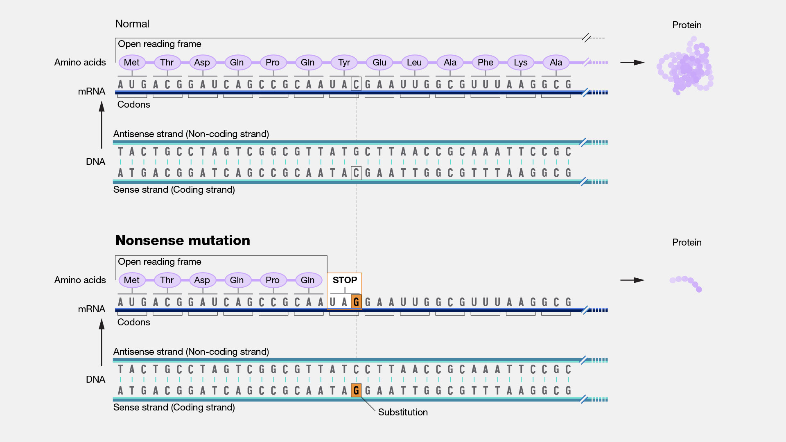

## Indicate the reference sequence

DNA:

- **c.**  → coding DNA
- **g.**  → genomic DNA
- **m.** → mitochondrial DNA

RNA:

- **r.**   → RNA

Protein:

- **p.**  → protein

## Code

| Substitution (for bases)     | >   |
| ---------------------------- | --- |
| range                        | -   |
| more change in one allele    | ;   |
| more transcripts / mosaicism | ,   |
| uncertain                    | ()  |
| allele                       | [ ] |
| deletion                     | del |
| duplication                  | dup |
| insertion                    | ins |
| inversion                    | inv |
| conversion                   | con |
| extension                    | ext |
| stop codon                   | X   |
| frame shift                  | fsX |
| opposite strand              | o   |
| translocation                | t   |

## Mutation

A [**mutation**](https://www.genome.gov/genetics-glossary/Mutation) is a change in the DNA sequence of an organism. Mutations can result from errors in DNA replication during cell division, exposure to mutagens or a viral infection. 

**Germline mutations** (that occur in eggs  and sperm) can be passed on to offspring, while somatic mutations (that  occur in body cells) are not passed on.         

The translation of disrupted sequence can be checked via [Expasy](https://web.expasy.org/translate/)

### Substitution

[Substitution](https://www.genome.gov/genetics-glossary/Substitution), as related to genomics, is a type of mutation in which one nucleotide is replaced by a different nucleotide. The term can also  refer to the replacement of one amino acid in a protein with a different amino acid.

- c.123A>G:  on cDNA, A in 123 is replaced by G

- p.P252R: on protein, proline (P) replaced by arginine (R)

### Point mutation

A **[point mutation](https://www.genome.gov/genetics-glossary/Point-Mutation)** occurs in a genome when a single base pair is added,  deleted or changed. While most point mutations are benign, they can also have various functional consequences, including changes in gene  expression or alterations in encoded proteins.

A **point mutation** is when a single base pair is altered. Point mutations can have one of three effects. 

- First, the base substitution can be a **silent mutation** where the altered codon corresponds to the same amino acid. 

- Second, the base substitution can be a **missense mutation** where the altered codon corresponds to a different amino acid. 

- Or third, the base substitution can be a **nonsense mutation** where the altered codon corresponds to a stop signal.

         

A **[missense mutation](https://www.genome.gov/genetics-glossary/Missense-Mutation)** is a DNA change that results in different amino  acids being encoded at a particular position in the resulting protein.  Some missense mutations alter the function of the resulting protein.         

A **[nonsense mutation](https://www.genome.gov/genetics-glossary/Nonsense-Mutation)** occurs in DNA when a sequence change gives rise to a stop codon rather than a codon specifying an amino acid. The presence  of the new stop codon results in the production of a shortened protein  that is likely non-functional.  

### Deletion

 **[Deletion](https://www.genome.gov/genetics-glossary/Deletion)**, as related to genomics, is a type of mutation that involves  the loss of one or more nucleotides from a segment of DNA. A deletion  can involve the loss of any number of nucleotides, from a single  nucleotide to an entire piece of a chromosome.         

- c.546delT, deletion of T in 546
- c.586_591del, for six bases deleted
- p.F508del,  deletion of phenylalanine (F) in 508

### Duplication

**[Duplication](https://www.genome.gov/genetics-glossary/Duplication)**, as related to genomics, refers to a type of mutation in  which one or more copies of a DNA segment (which can be as small as a  few bases or as large as a major chromosomal region) is produced.  Duplications occur in all organisms. For example, they are especially  prominent in plants, although they can also cause genetic diseases in  humans. Duplications have been an important mechanism in the evolution  of the genomes of humans and other organisms.         

- c.546dupT, duplication of T in 546 
- c.586_591dup, duplication of the segment 586 to 591
-  p.G4_Q6dup, duplication of the segment from glycine (G) in 4 to glutamine (Q) in 6

### Insertion

An **[insertion](https://www.genome.gov/genetics-glossary/Insertion)**, as related to genomics, is a type of mutation that  involves the addition of one or more nucleotides into a segment of DNA.  An insertion can involve the addition of any number of nucleotides, from a single nucleotide to an entire piece of a chromosome.

- c.546_547insT, insertion of T between 546 and 547
- c.1086_1087insGCGTGA, insertion of GCGTGA
- p.K2_L3insQS, insertion of glutamine serine between lysine (K) in 2 and leucine (L) in 3 

### Inversion

An **[inversion](https://www.genome.gov/genetics-glossary/Inversion)** in a chromosome occurs when a segment breaks off and reattaches within the same chromosome, but in reverse orientation. DNA may or may not be lost in the process.

- c.546_2031inv, segment 546 to 2031 inverted

### Frameshift

A **[frameshift mutation](https://www.genome.gov/genetics-glossary/Frameshift-Mutation)** in a gene refers to the insertion or deletion of  nucleotide bases in numbers that are not multiples of three. This is  important because a cell reads a gene’s code in groups of three bases  when making a protein. Each of these “triplet codons” corresponds to one of 20 different amino acids used to build a protein. If a mutation  disrupts this normal reading frame, then the entire gene sequence  following the mutation will be incorrectly read. This can result in the  addition of the wrong amino acids to the protein and/or the creation of a codon that stops the protein from growing longer.         

- p.R83SfsX15,  arginine (R) is the first amino acid changed, it is in position 83, it makes serine (S) instead, the length of the shift frame is 15, including the stop codon (X)

## Example

### Reference

1. <https://atlasgeneticsoncology.org/teaching/30067/nomenclature-for-the-description-of-mutations-and-other-sequence-variations>
2. <https://www.ncbi.nlm.nih.gov/pmc/articles/PMC1867422/>
3. <https://www.genome.gov/genetics-glossary/Mutation>