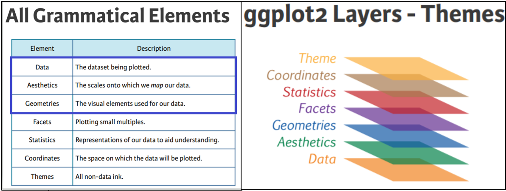

Modify components of a theme: <https://ggplot2.tidyverse.org/reference/theme>

## Design Concept of ggplot2
1. Theme: styles to be used, such as fonts, backgrounds, etc.
2. Coordinates: the plotting space
3. Statistics: data models and summaries
4. Facets: row and column layout of sub-plots
5. Geometries: shapes used to represent data (e.g. bar or scatter plot)
6. Aesthetics: the scales onto which the data will be mapped
7. Data: the actual data to be plotted

## Reference sheet

1. [Graphics and Data Visualization in R](https://girke.bioinformatics.ucr.edu/GEN242/slides/slides_18/)
   
2. [ggplot2 Theme Elements Reference Sheet](https://isabella-b.com/blog/ggplot2-theme-elements-reference/)
   
3. [ggplot2 Theme Elements Demonstration](https://henrywang.nl/ggplot2-theme-elements-demonstration/)