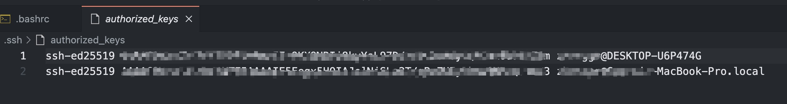

## Setup SSH Remote Keys

The following setup will help to ogin to server without using password and IP address with SSH remote key 

1. Add remote server host into lost hosts files

-  Mac: `code /etc/hosts` 
-  Windows: `C:\Windows\System32\drivers\etc\hosts`

 ```bash
### On the local machine: 
172.20.***.** nucleus.ccpa nucleus
172.20.***.** lipid-droplets.ccpa lipid-droplets
 ```
2. Generate public key
   
```bash
### 
local> cd ~/.ssh
local> ssh-keygen -t ed25519
local> ls
local> cat id_ed25519.pub 
```
3. Add the public key to remote server

```bash
###  On the remote server
remote> cd ~/.ssh
remote> chown -R chase:users .ssh
remote> chmod 700 .ssh
remote> scp username@local://home/user/.ssh/id_ed25519.pub .ssh/authorized_keys
remote> chmod 644 .ssh/authorized_keys
### For multiple machines, add the publick key to the authorized_keys in a new line
local> cat id_ed25519.pub
```


## Make Bash with colors 

In the remote server, add the following script to the `~/.bashrc`

```bash
PS1='\[\033[1;36m\]\u\[\033[1;37m\] @\[\033[1;32m\] \h:\[\033[1;33m\] \w\[\033[0;97m [\t]\[\033[0;97m \n\[\033[1;35m\]\$\[\033[0m\] '
```

## Powerful Terminal

```bash
### Install [Home-brew](https://brew.sh/)
/bin/bash -c "$(curl -fsSL https://raw.githubusercontent.com/Homebrew/install/HEAD/install.sh)"

### Change default shell from bash to zsh
chsh -s $(which zsh)

### Install oh-my-zsh in the terminal
sh -c "$(curl -fsSL https://raw.githubusercontent.com/ohmyzsh/ohmyzsh/master/tools/install.sh)"

###  change default theme to ys
open ~/.zshrc

ZSH_THEME="ys"

### install oh-my-zsh plugins
git clone https://github.com/zsh-users/zsh-syntax-highlighting.git ${ZSH_CUSTOM:-~/.oh-my-zsh/custom}/plugins/zsh-syntax-highlighting

git clone https://github.com/zsh-users/zsh-autosuggestions ${ZSH_CUSTOM:-~/.oh-my-zsh/custom}/plugins/zsh-autosuggestions

### make oh-my-zsh plugins working
vim ~/.zshrc
### then add following 
plugins=(
  git
  zsh-autosuggestions
  zsh-syntax-highlighting
  colored-man-pages
  colorize
)
### Make it working
source ~/.zshrc
```
## Mount remote files on mac


1. Install `macFUSE` and `SSHFS`: <https://osxfuse.github.io/>

2. Create mount directory in local 
```bash
$ mkdir ~/mount/mountpoint
```

3. Mount directory 
```bash
sshfs «user»@«host»: «mountpoint»
```
4. Un-mounting the remote volume

```bash
$ umount ~/mount/mountpoint
```


