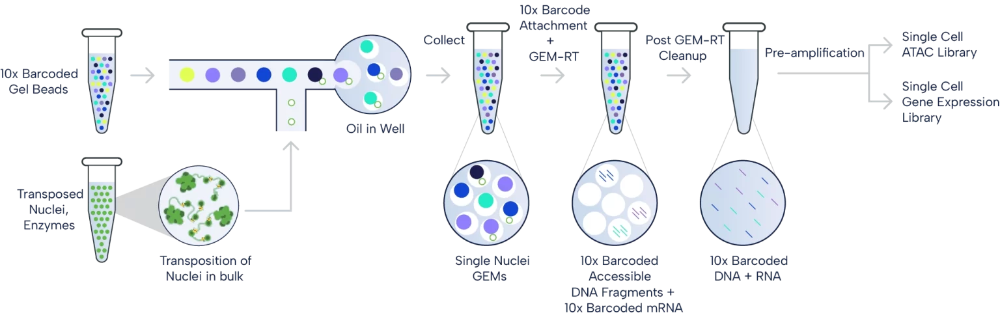

## Techniques

* Chromium

* Visium

* Xenium

### scATAC + Gene Expression

{fig-alt="10x Multiome Workflow" fig-align="center" width="800"}

* Unique benefits of 10x Multiome:
  * Cross-validate gene expression and chromatin accessibility data from the same cell
  * Identify activate regulatory elements and map out high resolution gene regulatory networks
