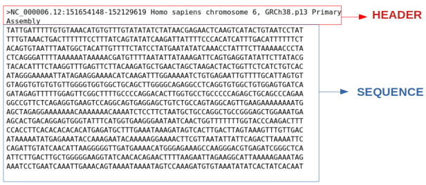
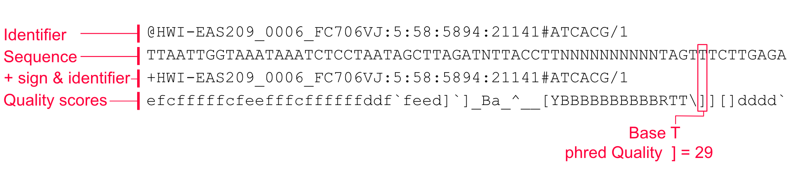
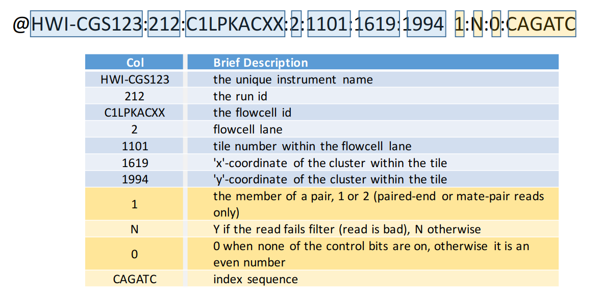

## FASTA

FASTA is text-based format for representing nucleotide or peptide sequences, where each sequence is preceded by a single-line description starting with a ">" character.

{width=600px}

* `.fna` can be used for nucleotide sequences
* `.faa` can be used for amino acid sequences
* `.frn` can be used for RNA sequences
* `.fa` can be used for either nucleotide or amino acid sequences

## FASTQ

FASTQ format is a text-based format for storing both nucleotide sequences and their corresponding quality scores. Each sequence entry consists of four lines:
* a sequence identifier starting with "@"
* the raw sequence letters
* a "+" separator line
* and a line with quality scores encoded as ASCII characters

{width=600px}
{width=600px}


## SAM

SAM (Sequence Alignment Map) is a tab-delimited text format for storing biological sequence alignment data. A SAM file consists of two parts: an optional **header section** and an **alignment section**.

### Header Section

Header lines begin with `@` and are optional but recommended:

| Tag | Description |
|-----|-------------|
| `@HD` | File-level metadata: format version and sort order |
| `@SQ` | Reference sequence dictionary (name, length) |
| `@RG` | Read group (sample, library, platform) |
| `@PG` | Program used to generate or process the file |
| `@CO` | One-line free-text comment |

### Alignment Section

Each alignment record has **11 mandatory fields**:

| Col | Field | Description |
|-----|-------|-------------|
| 1 | `QNAME` | Query template name (read name) |
| 2 | `FLAG` | Bitwise flag describing alignment properties |
| 3 | `RNAME` | Reference sequence name |
| 4 | `POS` | 1-based leftmost mapping position |
| 5 | `MAPQ` | Mapping quality (-10 log₁₀ probability of wrong mapping) |
| 6 | `CIGAR` | CIGAR string describing read alignment |
| 7 | `RNEXT` | Reference name of the mate/next read |
| 8 | `PNEXT` | Position of the mate/next read |
| 9 | `TLEN` | Template length (insert size) |
| 10 | `SEQ` | Segment sequence |
| 11 | `QUAL` | Phred-scaled base quality scores (ASCII, offset +33) |

### FLAG Values

Each FLAG is a sum of any of the following bitwise values:

| Bit | Value | Description |
|-----|-------|-------------|
| 0x1 | 1 | Read paired |
| 0x2 | 2 | Read mapped in proper pair |
| 0x4 | 4 | Read unmapped |
| 0x8 | 8 | Mate unmapped |
| 0x10 | 16 | Read on reverse strand |
| 0x20 | 32 | Mate on reverse strand |
| 0x40 | 64 | First in pair (read 1) |
| 0x80 | 128 | Second in pair (read 2) |
| 0x100 | 256 | Secondary alignment |
| 0x200 | 512 | Read fails platform/vendor quality checks |
| 0x400 | 1024 | PCR or optical duplicate |
| 0x800 | 2048 | Supplementary alignment |

For example, FLAG `99` = 1+2+32+64 means the read is paired, properly paired, the mate is on the reverse strand, and this is read 1.

### CIGAR String

The CIGAR string describes how the read aligns to the reference:

| Op | Description |
|----|-------------|
| `M` | Alignment match (match or mismatch) |
| `I` | Insertion to the reference |
| `D` | Deletion from the reference |
| `N` | Skipped region from reference (e.g., intron) |
| `S` | Soft clipping (clipped bases in SEQ) |
| `H` | Hard clipping (clipped bases not in SEQ) |
| `P` | Padding (silent deletion from padded reference) |
| `=` | Sequence match |
| `X` | Sequence mismatch |

For example, `50M2I30M` means 50 bases match, 2 inserted bases, then 30 more matching bases.

### File Size
* Exome: >50 GB
* Whole genome: 800 GB – 1 TB

## BAM

BAM (Binary Alignment Map) is the binary, compressed equivalent of SAM. It stores identical information but in a more space-efficient binary format.

### Key Characteristics

* Binary, BGZF-compressed (Blocked GNU Zip Format) version of SAM
* Requires an index file (`.bai` or `.csi`) for rapid random access to specific genomic regions
* Indexing is done with `samtools index`
* Must be coordinate-sorted before indexing

### Common Operations

```bash
# Convert SAM to BAM
samtools view -bS input.sam -o output.bam

# Sort BAM by coordinate
samtools sort output.bam -o output.sorted.bam

# Index sorted BAM
samtools index output.sorted.bam

# View BAM as text
samtools view output.sorted.bam

# View specific region
samtools view output.sorted.bam chr1:1000000-2000000
```

### File Size
* Exome: 2 – 20 GB
* Whole genome: 100 – 300 GB

## CRAM

CRAM is a highly space-efficient, reference-based compression format for storing sequence alignment data. It was developed by the European Bioinformatics Institute (EBI) and is supported by SAMtools and most modern NGS pipelines.

### Key Characteristics

* Stores reads as differences from a reference genome, yielding much smaller files than BAM
* Lossless or lossy compression options (lossy discards low-utility quality scores)
* Requires access to the reference genome used during alignment for decoding
* Supported by a `.crai` index file
* Typical compression: **~30–50% smaller than BAM** for the same data

### CRAM vs BAM vs SAM

| Feature | SAM | BAM | CRAM |
|---------|-----|-----|------|
| Encoding | Plain text | Binary | Binary |
| Compression | None | BGZF (gzip) | Reference-based |
| Typical WGS size | ~800 GB | ~100–300 GB | ~30–150 GB |
| Requires reference | No | No | Yes |
| Random access | No | Yes (with .bai) | Yes (with .crai) |

### Common Operations

```bash
# Convert BAM to CRAM
samtools view -C -T reference.fa -o output.cram input.bam

# Index CRAM
samtools index output.cram

# Convert CRAM back to BAM
samtools view -b -T reference.fa -o output.bam input.cram
```

## VCF

Variant Call Format (VCF) is a standard text-based format for storing gene sequence variations such as SNPs, indels, and structural variants. It is based on alignments in SAM/BAM format.

### Structure

VCF files consist of a **meta-information header**, a **header line**, and **data lines**.

```
##fileformat=VCFv4.2
##FILTER=<ID=PASS,Description="All filters passed">
##INFO=<ID=DP,Number=1,Type=Integer,Description="Total Depth">
##FORMAT=<ID=GT,Number=1,Type=String,Description="Genotype">
#CHROM  POS     ID      REF     ALT     QUAL    FILTER  INFO            FORMAT  SAMPLE1
chr1    925952  rs123   C       T       50      PASS    DP=100;AF=0.5   GT:DP   0/1:100
```

### Header Lines

* Lines starting with `##` are meta-information lines (key=value pairs)
* The last header line starts with `#CHROM` and defines the column names

### 8 Mandatory Columns

| Col | Field | Description |
|-----|-------|-------------|
| 1 | `CHROM` | Chromosome name |
| 2 | `POS` | 1-based position of the variant |
| 3 | `ID` | Variant identifier (e.g., dbSNP rs ID, or `.` if unknown) |
| 4 | `REF` | Reference allele at this position |
| 5 | `ALT` | Alternate allele(s), comma-separated |
| 6 | `QUAL` | Phred-scaled quality score for the variant call |
| 7 | `FILTER` | Filter status: `PASS` or reason for filtering |
| 8 | `INFO` | Semicolon-separated key=value pairs of variant annotations |

### Optional Columns

| Col | Field | Description |
|-----|-------|-------------|
| 9 | `FORMAT` | Colon-separated list of per-sample field keys |
| 10+ | `SAMPLE` | Per-sample data matching the FORMAT field |

### Common INFO Fields

| Tag | Description |
|-----|-------------|
| `DP` | Total read depth at the site |
| `AF` | Allele frequency |
| `AN` | Total number of alleles in called genotypes |
| `AC` | Allele count |
| `MQ` | RMS Mapping Quality |

### Genotype (GT) Field

The `GT` field in FORMAT encodes the genotype as allele indices separated by `/` (unphased) or `|` (phased):

* `0/0` — homozygous reference
* `0/1` — heterozygous
* `1/1` — homozygous alternate
* `1/2` — heterozygous with two non-reference alleles
* `./.` — missing genotype
## BCF

BCF (Binary Call Format) is the binary, compressed equivalent of VCF — analogous to the BAM/SAM relationship. It stores identical variant call information in a more efficient binary format.

### Key Characteristics

* Much faster to read/write and smaller than VCF for large datasets
* Can be indexed with `.csi` index files for random access
* Fully inter-convertible with VCF using `bcftools`

### Common Operations

```bash
# Convert VCF to BCF
bcftools view -O b -o output.bcf input.vcf.gz

# Index BCF
bcftools index output.bcf

# Convert BCF back to VCF
bcftools view -O v -o output.vcf input.bcf

# Filter BCF/VCF
bcftools filter -e 'QUAL<30 || DP<10' -o filtered.bcf input.bcf
```

## GTF
Gene Transfer Format (GTF) is a file format used to hold information about gene structure. It is a tab-delimited text format that consists of 9 columns:
1. `seqname`: Name of the chromosome or scaffold; chromosome names can be given with or without the 'chr' prefix.
2. `source`: Name of the program that generated this feature, or the data source (database or project name).
3. `feature`: Feature type name (e.g., Gene, Variation, Similarity).
4. `start`: Start position of the feature, with sequence numbering starting at 1.
5. `end`: End position of the feature, with sequence numbering starting at 1.
6. `score`: A floating point value.
7. `strand`: Defined as + (forward) or - (reverse).
8. `frame`: One of '0', '1' or '2'. '0' indicates that the first base of the feature is the first base of a codon, '1' that the second base is the first base of a codon, and so on.
9. `attribute`: A semicolon-separated list of tag-value pairs, providing additional information about each feature.


## GFF3

GFF3 (General Feature Format version 3) is the current standard for describing genomic features. It is an improvement over GFF2/GTF with better support for complex gene structures and hierarchical relationships between features.

### 9 Mandatory Columns (tab-delimited)

| Col | Field | Description |
|-----|-------|-------------|
| 1 | `seqid` | Chromosome or scaffold name |
| 2 | `source` | Program that generated the feature, or database name |
| 3 | `type` | Feature type using Sequence Ontology terms (e.g., `gene`, `mRNA`, `exon`, `CDS`) |
| 4 | `start` | 1-based start position |
| 5 | `end` | 1-based end position (inclusive) |
| 6 | `score` | Floating point score, or `.` if not applicable |
| 7 | `strand` | `+` (forward), `-` (reverse), `.` (unstranded), or `?` (unknown) |
| 8 | `phase` | For CDS features: `0`, `1`, or `2` (reading frame offset); `.` otherwise |
| 9 | `attributes` | Semicolon-separated `tag=value` pairs |

### Key Attributes

| Attribute | Description |
|-----------|-------------|
| `ID` | Unique identifier for the feature within the file |
| `Name` | Display name for the feature |
| `Parent` | Establishes parent–child relationships (e.g., exon's parent is an mRNA) |
| `Dbxref` | Database cross-reference |
| `Note` | Free-text note |

### Example

```
##gff-version 3
chr1  Ensembl  gene    11869  14409  .  +  .  ID=ENSG00000223972;Name=DDX11L1;biotype=transcribed_unprocessed_pseudogene
chr1  Ensembl  mRNA    11869  14409  .  +  .  ID=ENST00000456328;Parent=ENSG00000223972;Name=DDX11L1-202
chr1  Ensembl  exon    11869  12227  .  +  .  Parent=ENST00000456328
chr1  Ensembl  exon    12613  12721  .  +  .  Parent=ENST00000456328
chr1  Ensembl  exon    13221  14409  .  +  .  Parent=ENST00000456328
```

### GFF3 vs GTF

| Feature | GTF | GFF3 |
|---------|-----|------|
| Hierarchy | Implicit (by gene_id/transcript_id) | Explicit via `Parent=` attribute |
| Feature types | Restricted (gene, transcript, exon, CDS) | Any Sequence Ontology term |
| Multiple parents | Not supported | Supported |
| UCSC/Ensembl | Common for downloads | Increasingly adopted |


## BED

BED (Browser Extensible Data) is a flexible tab-delimited format for describing genomic regions. It is widely used for representing peaks, intervals, annotations, and other positional data in genome browsers (UCSC, IGV).

### Coordinates

BED uses **0-based, half-open** coordinates: the start position is 0-indexed and the end is exclusive. For example, `chr1  0  100` spans the first 100 bases.

::: {.callout-note}
This differs from SAM/VCF/GFF3 which use **1-based** coordinates.
:::

### Fields

BED has 3 required fields and up to 12 fields total:

| Col | Field | Required | Description |
|-----|-------|----------|-------------|
| 1 | `chrom` | Yes | Chromosome name |
| 2 | `chromStart` | Yes | 0-based start position |
| 3 | `chromEnd` | Yes | End position (exclusive) |
| 4 | `name` | No | Name of the feature |
| 5 | `score` | No | Score (0–1000) |
| 6 | `strand` | No | `+` or `-` |
| 7 | `thickStart` | No | Start position for thick drawing |
| 8 | `thickEnd` | No | End position for thick drawing |
| 9 | `itemRgb` | No | Display color (R,G,B) |
| 10 | `blockCount` | No | Number of blocks (exons) |
| 11 | `blockSizes` | No | Comma-separated list of block sizes |
| 12 | `blockStarts` | No | Comma-separated block start positions (relative to `chromStart`) |

### Example

```
chr7   127471196  127472363  Pos1   0  +  127471196  127472363  255,0,0
chr7   127472363  127473530  Pos2   0  +  127472363  127473530  255,0,0
```


## bedGraph

bedGraph is a variant of the BED format for displaying continuous-valued data (e.g., sequencing coverage, ChIP-seq signal) across genomic coordinates. Each line defines a region and an associated data value.

### Format

```
track type=bedGraph name="Coverage" description="Read depth"
chr1  0      1000   5.0
chr1  1000   2000   12.3
chr1  2000   2500   0.0
```

* Uses 0-based half-open coordinates (same as BED)
* Only 4 columns: `chrom`, `start`, `end`, `value`
* Regions must be sorted and non-overlapping within a chromosome
* The optional `track` header line provides display metadata


## BigWig / BigBed

BigWig and BigBed are binary, indexed versions of WIG/bedGraph and BED files respectively. They are designed for efficient remote access and visualization in genome browsers.

| Format | Text equivalent | Use case |
|--------|----------------|----------|
| BigWig (`.bw`) | WIG / bedGraph | Continuous signal (coverage, scores) |
| BigBed (`.bb`) | BED | Discrete features/annotations |

### Key Advantages

* **Indexed**: supports fast random access to any genomic region
* **Remote access**: genome browsers (UCSC, IGV) can stream only the required region
* Much smaller than equivalent text files

### Common Operations

```bash
# Convert bedGraph to BigWig
bedGraphToBigWig input.bedGraph chrom.sizes output.bw

# Convert BED to BigBed
bedToBigBed input.bed chrom.sizes output.bb

# Extract a region from BigWig to bedGraph
bigWigToBedGraph -chrom=chr1 -start=0 -end=1000000 input.bw output.bedGraph
```