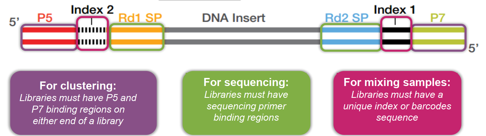

## Sequencing Basics

{width=600px}

- Clusters: Groups of DNA strands positioned closely together. Each clustter represents thousands of copies of the same DNA fragment in a 1-2 micron spot

- Flowcell: A thick glass slide with channels or lanes. Cluster generation and sequencing occur here. Each lane is randomly coated with a lawn of oligos that are complementary to library adapters.
    - Random Flow cell
    - Patterned Flow cell

- Reads: The sequences of nucleotides (A, T, C, G) generated from the DNA fragments during sequencing.

- Lanes: Individual channels on a flowcell that can be used for separate samples or experiments.

- Indexing: Adding unique sequences (barcodes) to DNA fragments to identify different samples in a single sequencing run.

- Adapters: Short DNA sequences attached to the ends of DNA fragments to facilitate binding to the flowcell and initiation of sequencing.

- Paired-end sequencing: Sequencing both ends of a DNA fragment to provide more information and improve accuracy.

- Coverage: The average number of times a nucleotide is read during sequencing, indicating the depth of sequencing.

- Read length: The number of nucleotides in a single read generated by the sequencer.

- Throughput: The total amount of data generated by a sequencing run, often measured in gigabases (Gb) or terabases (Tb).

- Multiplexing: Combining multiple samples in a single sequencing run using unique indexes to save time and cost.

- Demultiplexing: The process of separating mixed sequencing data back into individual samples based on their unique indexes.

- Quality scores: Numerical values assigned to each nucleotide in a read, indicating the confidence in the accuracy of that base call.

- Phred score: A specific type of quality score that represents the probability of an incorrect base call, commonly used in sequencing data analysis.

- FASTQ format: A text-based file format that stores both nucleotide sequences and their corresponding quality scores.

- BCL files: Binary files generated by Illumina sequencers that contain raw base call data and quality scores before conversion to FASTQ format.

## Quality scores

- Illumina uses Phred quality scores (Q scores) to represent the accuracy of each base call in sequencing data.
- The Q score is calculated using the formula: Q = -10 log10(P), where P is the probability of an incorrect base call.
- Higher Q scores indicate higher confidence in the accuracy of the base call.
- For example:
    - Q10: 90% accuracy (1 in 10 chance of error)
    - Q20: 99% accuracy (1 in 100 chance of error)
    - Q30: 99.9% accuracy (1 in 1000 chance of error)
    - Q40: 99.99% accuracy (1 in 10,000 chance of error)
    - Q50: 99.999% accuracy (1 in 100,000 chance of error)

## Illumina Sequencing Libraries

The nature of Illumina sequencing is still sequencing by synthesis (SBS). Any SBS method requires the presence of adaptors, which are short double-stranded DNA oligos whose sequences are known to us. The adaptors are designed by scientists, and there are a few popular adaptor sequences that are used in the NGS field. The following three (actually two main types to be honest) are the most popular ones:

### Truseq Single Index Library

<pre class="seq">
5'- <p5>AATGATACGGCGACCACCGAGATCTACAC</p5><s5>TCTTTCCCTACACGACGCTCTTCCGATCT</s5>-insert-<s7>AGATCGGAAGAGCACACGTCTGAACTCCAGTCAC</s7><t7>NNNNNNNN</t7><p7>ATCTCGTATGCCGTCTTCTGCTTG</p7> -3'
3'- <p5>TTACTATGCCGCTGGTGGCTCTAGATGTG</p5><s5>AGAAAGGGATGTGCTGCGAGAAGGCTAGA</s5>-insert-<s7>TCTAGCCTTCTCGTGTGCAGACTTGAGGTCAGTG</s7><t7>NNNNNNNN</t7><p7>TAGAGCATACGGCAGAAGACGAAC</p7> -5'
          <p5>Illumina P5</p5>                   <s5>Truseq Read 1</s5>                        <s7>Truseq Read 2</s7>                 <t7>i7</t7>        <p7>Illumina P7</p7>
</pre>

### Truseq Dual Index Library

<pre class="seq">
5'- <p5>AATGATACGGCGACCACCGAGATCTACAC</p5><t7>NNNNNNNN</t7><s5>ACACTCTTTCCCTACACGACGCTCTTCCGATCT</s5>-insert-<s7>AGATCGGAAGAGCACACGTCTGAACTCCAGTCAC</s7><t7>NNNNNNNN</t7><p7>ATCTCGTATGCCGTCTTCTGCTTG</p7> -3'
3'- <p5>TTACTATGCCGCTGGTGGCTCTAGATGTG</p5><t7>NNNNNNNN</t7><s5>TGTGAGAAAGGGATGTGCTGCGAGAAGGCTAGA</s5>-insert-<s7>TCTAGCCTTCTCGTGTGCAGACTTGAGGTCAGTG</s7><t7>NNNNNNNN</t7><p7>TAGAGCATACGGCAGAAGACGAAC</p7> -5'
          <p5>Illumina P5</p5>               <t7>i5</t7>            <s5>Truseq Read 1</s5>                          <s7>Truseq Read 2</s7>                 <t7>i7</t7>        <p7>Illumina P7</p7>
</pre>

### Nextera Dual Index Library

<pre class="seq">
5'- <p5>AATGATACGGCGACCACCGAGATCTACAC</p5><t7>NNNNNNNN</t7><r1>TCGTCGGCAGCGTCAGATGTGTATAAGAGACAG</r1>-insert-<r2>CTGTCTCTTATACACATCTCCGAGCCCACGAGAC</r2><t7>NNNNNNNN</t7><p7>ATCTCGTATGCCGTCTTCTGCTTG</p7> -3'
3'- <p5>TTACTATGCCGCTGGTGGCTCTAGATGTG</p5><t7>NNNNNNNN</t7><r1>AGCAGCCGTCGCAGTCTACACATATTCTCTGTC</r1>-insert-<r2>GACAGAGAATATGTGTAGAGGCTCGGGTGCTCTG</r2><t7>NNNNNNNN</t7><p7>TAGAGCATACGGCAGAAGACGAAC</p7> -5'
           <p5>Illumina P5</p5>              <t7>i5</t7>             <r1>Nextera Read 1</r1>                                <r2>Nextera Read 2</r2>        <t7>i7</t7>         <p7>Illumina P7</p7>
</pre>

There are some other adaptors that can be used, but they either become obsolete or not used usually. If you are interested, you can check the Illumina adapter sequences document for full details. Basically, the nature of an Illumina library preparation is the process of adding those coloured adaptor sequences to both sides of the DNA of your interest, which is the "-insert-" bit in the above examples. All the commercial kits you buy for the library preparation do EXACTLY that, no matter where you buy them, no matter what you want to sequence. In addition, you can also mix different types of adaptors due to the reasons mentioned in the "Library sequencing" section below. For example, you can use Truseq Read 1 at the left hand side, and Nextera Read 2 at the right hand side. Or you can use Nextera Read 1 at the left hand side and Truseq Read 2 at the right hand side. It is totally fine but not recommended for beginners.

The "N"s in the above examples are the indices, or barcodes that discriminate different samples. The index at the right hand side is often called "i7", or index1, which is the index in the P7 primer; the index at the left hand side is called "i5", or index2, which is the index in the P5 primer. This is because the index "i7" is sequenced first before "i5" is sequenced.

Now, the mission is: how to add those adaptors? Well, this is where you can become creative. In [A profusion of confusion in NGS methods naming](https://www.nature.com/articles/nmeth.4558/), Hadfield and Retief mentioned over 300 NGS methods in their [Enseqlopedia wiki](http://www.enseqlopedia.com/enseqlopedia). ALL of them do and ONLY do one thing: add those adaptors to the sides of the DNA they want to sequence. Then, what is the difference among all those methods? They differ from how they add those adaptors.

Another important detail is that we should know the only required sequences are the following two:

<pre class="seq">
Illumina P5 adaptor: 5'- <p5>AATGATACGGCGACCACCGAGATCTACAC</p5> -3'
Illumina P7 adaptor: 5'- <p7>CAAGCAGAAGACGGCATACGAGAT</p7> -3'
</pre>

If you use Illumina sequencing, you have to use and make sure they are at the sides of your DNA fragments, like shown in the three examples above. The adaptor sequences in the middle like Truseq Read 1, Truseq Read 2, Nextera Read 1 and Nextera Read 2 can be changed. If you change them, you have to add your own sequencing primers to the machine during sequencing. A few single cell genomic methods used their own adaptors.

### Library sequencing

Once those adaptors are added properly, we are ready to sequence them using Illumina machines. In the sequencing reagents provided by Illumina, the sequencing primers are actually a mixture of different primers, including Truseq, Nextera and even those primers from kits that are obsolete. Therefore, you actually can sequence different types of libraries together. For example, Truseq libraries and Nextera libraries can be mixed together and sequenced together without any problem. There are some slight differences among different Illumina machines, in terms of how they sequence Read 1, Read 2, Index 1 and Index 2.

* Step 1: Add Read 1 sequencing primer mixture to sequence the first read (bottom strand as template)

**Truseq Single Index Library:**

<pre class="seq">
                         5'- <s5>ACACTCTTTCCCTACACGACGCTCTTCCGATCT</s5>---->
3'- <p5>TTACTATGCCGCTGGTGGCTCTAGATGTG</p5><s5>AGAAAGGGATGTGCTGCGAGAAGGCTAGA</s5>-insert-<s7>TCTAGCCTTCTCGTGTGCAGACTTGAGGTCAGTG</s7><t7>NNNNNNNN</t7><p7>TAGAGCATACGGCAGAAGACGAAC</p7> -5'
</pre>

**Truseq Dual Index Library:**

<pre class="seq">
                                     5'- <s5>ACACTCTTTCCCTACACGACGCTCTTCCGATCT</s5>---->
3'- <p5>TTACTATGCCGCTGGTGGCTCTAGATGTG</p5><t7>NNNNNNNN</t7><s5>TGTGAGAAAGGGATGTGCTGCGAGAAGGCTAGA</s5>-insert-<s7>TCTAGCCTTCTCGTGTGCAGACTTGAGGTCAGTG</s7><t7>NNNNNNNN</t7><p7>TAGAGCATACGGCAGAAGACGAAC</p7> -5'
</pre>

**Nextera Dual Index Library:**

<pre class="seq">
                                     5'- <r1>TCGTCGGCAGCGTCAGATGTGTATAAGAGACAG</r1>------>
3'- <p5>TTACTATGCCGCTGGTGGCTCTAGATGTG</p5><t7>NNNNNNNN</t7><r1>AGCAGCCGTCGCAGTCTACACATATTCTCTGTC</r1>-insert-<r2>GACAGAGAATATGTGTAGAGGCTCGGGTGCTCTG</r2><t7>NNNNNNNN</t7><p7>TAGAGCATACGGCAGAAGACGAAC</p7> -5'
</pre>

* Step 2: Add Index 1 sequencing primer mixture to sequence the first index (index 1, i7, bottom strand as template)

**Truseq Single Index Library:**

<pre class="seq">
                                                                               5'- <s7>GATCGGAAGAGCACACGTCTGAACTCCAGTCAC</s7>------->
3'- <p5>TTACTATGCCGCTGGTGGCTCTAGATGTG</p5><s5>AGAAAGGGATGTGCTGCGAGAAGGCTAGA</s5>-insert-<s7>TCTAGCCTTCTCGTGTGCAGACTTGAGGTCAGTG</s7><t7>NNNNNNNN</t7><p7>TAGAGCATACGGCAGAAGACGAAC</p7> -5'
</pre>

**Truseq Dual Index Library:**

<pre class="seq">
                                                                                         5'- <s7>GATCGGAAGAGCACACGTCTGAACTCCAGTCAC</s7>------->
3'- <p5>TTACTATGCCGCTGGTGGCTCTAGATGTG</p5><t7>NNNNNNNN</t7><s5>TGTGAGAAAGGGATGTGCTGCGAGAAGGCTAGA</s5>-insert-<s7>TCTAGCCTTCTCGTGTGCAGACTTGAGGTCAGTG</s7><t7>NNNNNNNN</t7><p7>TAGAGCATACGGCAGAAGACGAAC</p7> -5'
</pre>

**Nextera Dual Index Library:**

<pre class="seq">
                                                                                        5'- <r2>CTGTCTCTTATACACATCTCCGAGCCCACGAGAC</r2>------->
3'- <p5>TTACTATGCCGCTGGTGGCTCTAGATGTG</p5><t7>NNNNNNNN</t7><r1>AGCAGCCGTCGCAGTCTACACATATTCTCTGTC</r1>-insert-<r2>GACAGAGAATATGTGTAGAGGCTCGGGTGCTCTG</r2><t7>NNNNNNNN</t7><p7>TAGAGCATACGGCAGAAGACGAAC</p7> -5'
</pre>

* Step 3 (MiSeq, HiSeq 2000/2500, MiniSeq Rapid and NovaSeq 6000 v1.0): Folds over and sequence the second index (index 2, i5, bottom strand as template)

**Truseq Single Index Library (not really needed):**

<pre class="seq">
5'- <p5>AATGATACGGCGACCACCGAGATCTACAC</p5>------->
3'- <p5>TTACTATGCCGCTGGTGGCTCTAGATGTG</p5><s5>AGAAAGGGATGTGCTGCGAGAAGGCTAGA</s5>-insert-<s7>TCTAGCCTTCTCGTGTGCAGACTTGAGGTCAGTG</s7><t7>NNNNNNNN</t7><p7>TAGAGCATACGGCAGAAGACGAAC</p7> -5'
</pre>

**Truseq Dual Index Library:**

<pre class="seq">
5'- <p5>AATGATACGGCGACCACCGAGATCTACAC</p5>------->
3'- <p5>TTACTATGCCGCTGGTGGCTCTAGATGTG</p5><t7>NNNNNNNN</t7><s5>TGTGAGAAAGGGATGTGCTGCGAGAAGGCTAGA</s5>-insert-<s7>TCTAGCCTTCTCGTGTGCAGACTTGAGGTCAGTG</s7><t7>NNNNNNNN</t7><p7>TAGAGCATACGGCAGAAGACGAAC</p7> -5'
</pre>

**Nextera Dual Index Library:**

<pre class="seq">
5'- <p5>AATGATACGGCGACCACCGAGATCTACAC</p5>------->
3'- <p5>TTACTATGCCGCTGGTGGCTCTAGATGTG</p5><t7>NNNNNNNN</t7><r1>AGCAGCCGTCGCAGTCTACACATATTCTCTGTC</r1>-insert-<r2>GACAGAGAATATGTGTAGAGGCTCGGGTGCTCTG</r2><t7>NNNNNNNN</t7><p7>TAGAGCATACGGCAGAAGACGAAC</p7> -5'
</pre>

* Step 3 (iSeq 100, MiniSeq Standard, NextSeq, HiSeq X, HiSeq 3000/4000 and NovaSeq 6000 v1.5): Add Index 2 sequencing primer mixture to sequence the second index (index 2, i5, top strand as template)

**Truseq Single Index Library:**

<pre class="seq">
5'- <p5>AATGATACGGCGACCACCGAGATCTACAC</p5><s5>TCTTTCCCTACACGACGCTCTTCCGATCT</s5>-insert-<s7>AGATCGGAAGAGCACACGTCTGAACTCCAGTCAC</s7><t7>NNNNNNNN</t7><p7>ATCTCGTATGCCGTCTTCTGCTTG</p7> -3'
                     <-------<s5>TGTGAGAAAGGGATGTGCTGCGAGAAGGCTAGA</s5> -5'
</pre>

**Truseq Dual Index Library:**

<pre class="seq">
5'- <p5>AATGATACGGCGACCACCGAGATCTACAC</p5><t7>NNNNNNNN</t7><s5>ACACTCTTTCCCTACACGACGCTCTTCCGATCT</s5>-insert-<s7>AGATCGGAAGAGCACACGTCTGAACTCCAGTCAC</s7><t7>NNNNNNNN</t7><p7>ATCTCGTATGCCGTCTTCTGCTTG</p7> -3'
                                 <-------<s5>TGTGAGAAAGGGATGTGCTGCGAGAAGGCTAGA</s5> -5'
</pre>

**Nextera Dual Index Library:**

<pre class="seq">
5'- <p5>AATGATACGGCGACCACCGAGATCTACAC</p5><t7>NNNNNNNN</t7><r1>TCGTCGGCAGCGTCAGATGTGTATAAGAGACAG</r1>-insert-<r2>CTGTCTCTTATACACATCTCCGAGCCCACGAGAC</r2><t7>NNNNNNNN</t7><p7>ATCTCGTATGCCGTCTTCTGCTTG</p7> -3'
                                 <-------<r1>AGCAGCCGTCGCAGTCTACACATATTCTCTGTC</r1> -5'
</pre>

* Step 4: Cluster regeneration, add Read 2 sequencing primer mixture to sequence the second read (top strand as template)

**Truseq Single Index Library:**

<pre class="seq">
5'- <p5>AATGATACGGCGACCACCGAGATCTACAC</p5><s5>TCTTTCCCTACACGACGCTCTTCCGATCT</s5>-insert-<s7>AGATCGGAAGAGCACACGTCTGAACTCCAGTCAC</s7><t7>NNNNNNNN</t7><p7>ATCTCGTATGCCGTCTTCTGCTTG</p7> -3'
                                                                            <------<s7>TCTAGCCTTCTCGTGTGCAGACTTGAGGTCAGTG</s7> -5'
</pre>

**Truseq Dual Index Library:**

<pre class="seq">
5'- <p5>AATGATACGGCGACCACCGAGATCTACAC</p5><t7>NNNNNNNN</t7><s5>ACACTCTTTCCCTACACGACGCTCTTCCGATCT</s5>-insert-<s7>AGATCGGAAGAGCACACGTCTGAACTCCAGTCAC</s7><t7>NNNNNNNN</t7><p7>ATCTCGTATGCCGTCTTCTGCTTG</p7> -3'
                                                                                  <------<s7>TCTAGCCTTCTCGTGTGCAGACTTGAGGTCAGTG</s7> -5'
</pre>

**Nextera Dual Index Library:**

<pre class="seq">
5'- <p5>AATGATACGGCGACCACCGAGATCTACAC</p5><t7>NNNNNNNN</t7><r1>TCGTCGGCAGCGTCAGATGTGTATAAGAGACAG</r1>-insert-<r2>CTGTCTCTTATACACATCTCCGAGCCCACGAGAC</r2><t7>NNNNNNNN</t7><p7>ATCTCGTATGCCGTCTTCTGCTTG</p7> -3'
                                                                                         <------<r2>GACAGAGAATATGTGTAGAGGCTCGGGTGCTCTG</r2> -5'
</pre>

## Illumina 5-base

1. Map: Align reads to the reference.
2. Call: Decide if a "T" is a 5th base (5mC) or a mutation.
3. Overlay: Compare those sites to a database of known genes and CpG islands.
4. Compare: Look for differences between samples to find "Biological Hits."
