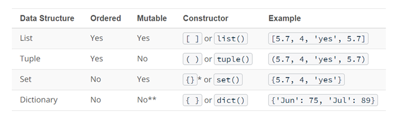

## Data Stuctures

{width=800px}

in Python, understanding data types and structures is essential for writting effective code. Data types determine the kind of data a variable can hold, while data structures allow you to organize and manage that data efficiently.

- Numbers: Represent numerical values, including integers and floating-point numbers.
- Strings: Represent sequences of characters, used for text manipulation.
- Booleans: Represent truth values, either True or False.
- Lists: Ordered collections of items, allowing for duplicate values and mutable operations.
- Tuples: Ordered collections of items, similar to lists but immutable.
- Sets: Unordered collections of unique items, useful for membership testing and eliminating duplicates.
- Dictionaries: Unordered, Key-value pairs that allow for efficient data retrieval based on unique keys.

```{python}
## List: mutable, ordered collection
fruits = ["apple", "banana", "cherry"]
print("List of fruits:", fruits)

## Dictionary: unordered, key-value pairs
person = {"name": "Alice", "age": 30, "city": "New York"}
print("Dictionary of person:", person)

## Tuple: immutable, ordered collection
dimensions = (1920, 1080)
print("Tuple of dimensions:", dimensions)

## Set: unordered collection of unique items
unique_numbers = {1, 2, 3, 4, 5}
print("Set of unique numbers:", unique_numbers)
```

* in R, the `list` is a versatile container type that can hold elements of different types and structures.
* There is no single direct equivalent of R's `list` in Python that support all the same features.
* Instead, there are (at least) 4 different Python container types we need to aware:
    + `list`: ordered, mutable, allows duplicate elements, created using `[]`
    + `dict`: unordered, mutable, key-value pairs, created using `{}`
    + `tuple`: ordered, immutable, allows duplicate elements, created using `()`
    + `set`: unordered, mutable, no duplicate elements, created using `{}`

## Control Flow
Control flow in Python allows you to make decisions and execute different blocks of code based on conditions.
Loops enable you to repeat a block of code multiple times.

Best practices for control flow and loops include:
- Keep conditions simple and clear. Break down complex conditions into smaller parts.
- Use meaningful variable names to enhance readability.
- Avoid deeply nested loops and conditions to maintain code clarity.
- Use comments to explain the purpose of complex conditions or loops.
- Test edge cases to ensure your control flow behaves as expected.

```{python}
#| eval: false

# Conditional statements
x = 10
if x > 5:
    print("x is greater than 5")
elif x == 5:
    print("x is equal to 5")
else:
    print("x is less than 5")
```
## Iteration
```{python}
#| eval: false

## For loop: iterating over a list
for i in range(5):
    print("Iteration:", i)

## While loop: continues until a condition is met
count = 0
while count < 5:
    print("Count is:", count)
    count += 1
```

Conditional execution in Python is achieved using the if/else construct (if and else are reserved words).

```{python}
#| eval: false

# Conidtional execution
x = 10
if x > 10:
    print("I am a big number")
else:
    print("I am a small number")

# Multi-way if/else
x = 10
if x > 10:
    print("I am a big number")
elif x > 5:
    print("I am kind of small")
else:
    print("I am really number")
```

## Loops

Two looping constructs in Python

- `For` : used when the number of possible iterations (repetitions) are known in advance

- `While`: used when the number of possible iterations (repetitions) can not be defined in advance. Can lead to infinite loops, if conditions are not handled properly

```{python}
#| eval: false

for customer in ["John", "Mary", "Jane"]:
    print("Hello ", customer)
    print("Please pay")
    collectCash()
    giveGoods()

hour_of_day = 9
while hour_of_day < 17:
    moveToWarehouse()
    locateGoods()
    moveGoodsToShip()
    hour_of_day = getCurrentTime()
```
What happens if you need to stop early? We use the `break` keyword to do this.

It stops the iteration immediately and moves on to the statement that follows the looping

```{python}
#| eval: false

while hour_of_day < 17:
    if shipIsFull() == True:
        break
    moveToWarehouse()
    locateGoods()
    moveGoodsToShip()
    hour_of_day = getCurrentTime()
collectPay()
```
What happens when you want to just skip the rest of the steps? We can use the `continue` keyword for this.

It skips the rest of the steps but moves on to the next iteration.

```{python}
#| eval: false
for customer in ["John", "Mary", "Jane"]:
    print("Hello ", customer)
    print("Please pay")
    paid = collectCash()
    if paid == False:
        continue
    giveGoods()
```
## Exceptions
- Exceptions are errors that are found during execution of the Python program.
- They typically cause the program to fail.
- However we can handle them using the ‘try/except’ construct.

```{python}
#| eval: false
num = input("Please enter a number: ")
try:
    num = int(num)
    print("number squared is " + str(num**2))
except:
    print("You did not enter a valid number")
```

## Dataframe

```{.python}
#| eval: true

## Python's dataframe comes form the pandas library
import pandas as pd

## It's actually  a type of dictionary of lists
py_df = pd.DataFrame(
    {
        'Name': ['Alice', 'Bob', 'Charlie'],
        'Age': [25, 30, 35],
        'City': ['New York', 'Los Angeles', 'Chicago']
    }
)

print(py_df)
```
